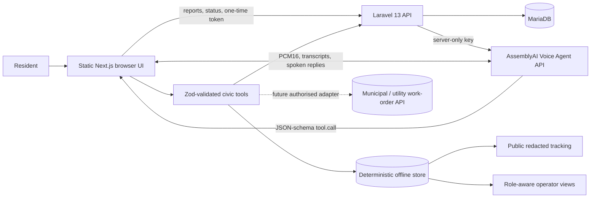

# FixSA Voice

> **Speak. Track. Fix.** A mobile-first voice service-delivery agent built by VALO Systems for the AssemblyAI Voice Agent Hackathon.


FixSA Voice turns a resident’s spoken description of a water leak, pothole, electricity fault, sewer overflow, broken streetlight, illegal dumping, or damaged public asset into a complete, deduplicated, trackable work order. It asks only for missing information, explains possible duplicates, reads the completed report back, and requires explicit confirmation before creating or merging anything.

Its winning differentiator is **Proof of Fix**: “resolved” becomes a claim awaiting resident verification. A resident can confirm the repair, report a partial fix, or dispute the closure by voice. Partial and failed repairs reopen automatically with a public and operator audit event. Trust is the product.

## Demo boundary

FixSA Voice is a **hackathon demonstration**, not an official government, municipal, utility, dispatch, or emergency service. All seeded people, locations, references, teams, metrics, notes, and status changes are synthetic. A demo reference is not evidence that a real operator received a report.

If speech indicates immediate danger, the ordinary work-order flow stops. The interface tells the resident to move to safety and contact the appropriate official local emergency service. It does not fabricate or display an unverified emergency number.

## Why this product

Residents naturally describe a situation as a story, while service systems expect structured fields. Traditional forms make residents translate between the two. FixSA Voice uses real-time conversation to collect category, location, landmark, duration, severity, hazards, people affected, and supporting detail—then applies priority, SLA, duplicate, safety, and privacy rules consistently.

## Product journeys

- Public landing, report, clarification/review, success, tracking, demo scenarios, about, privacy, terms, accessibility, help, 404, and recovery states.
- Operator dashboard, report queue, report detail, duplicate review, accessible map triage, analytics, and settings/integrations.
- Deterministic one-click scenarios for Proof of Fix, a water leak, dangerous electricity fault, pothole, and duplicate report.
- Resident, operator, and supervisor-ready data model, with Laravel Sanctum protecting operator mutations and an explicitly labelled no-credential judge preview.

## Screenshots

| Resident experience | Operations workspace |
|---|---|
|  |  |

Additional captures: [mobile reporting](docs/screenshots/mobile-report.png) and [judge scenarios](docs/screenshots/judge-scenarios.png).

## AssemblyAI integration

The real adapter uses the [AssemblyAI Voice Agent API](https://www.assemblyai.com/docs/voice-agents/voice-agent-api):

1. The browser requests a single-use, short-lived token from the Laravel `/api/v1/voice/token` endpoint.
2. Laravel mints it with `ASSEMBLYAI_API_KEY`; the permanent key never reaches browser JavaScript.
3. The browser opens `wss://agents.assemblyai.com/v1/ws`, sends an inline FixSA agent configuration (or an optional stored agent ID), and streams 24 kHz PCM16 audio.
4. `transcript.user.delta` drives visible live partials; final user and agent events build the accessible conversation timeline.
5. JSON-schema function tools call the same validated application contract used by demo mode.
6. `session.end` closes cleanly so a paid session does not remain in its resume grace period.

The implementation follows AssemblyAI’s current [browser integration](https://www.assemblyai.com/docs/voice-agents/voice-agent-api/browser-integration), [client-side tools](https://www.assemblyai.com/docs/voice-agents/voice-agent-api/tools/client-side-tools), and [events](https://www.assemblyai.com/docs/voice-agents/voice-agent-api/events-reference) guidance, verified 18 September 2026.

### Structured tools

- `classify_service_issue`
- `search_nearby_reports`
- `confirm_report_details`
- `create_service_request`
- `merge_with_existing_report`
- `attach_evidence`
- `get_report_status`
- `verify_resolution`
- `update_report_status`

Create and merge operations fail closed without explicit confirmation. Immediate-danger electricity content produces `emergency_hold`, and public evidence is redacted before output.

### Language position

The UI exposes **English only**. Universal-3 Pro Streaming and current multilingual streaming offerings support additional languages, but FixSA does not claim production quality for them without South African user research, accent testing, and an authorised language rollout. The extension path is documented in [docs/language-and-accent-testing.md](docs/language-and-accent-testing.md).

## Architecture



See [docs/architecture.md](docs/architecture.md), [docs/data-flow.md](docs/data-flow.md), and [docs/database-design.md](docs/database-design.md) for the boundaries, transaction rules, and schema rationale. Executable Laravel migrations are in `api/database/migrations/`; the older SQL files remain historical reference material.

## Privacy and safety

- Consent is required before microphone access or transcription.
- Audio is ephemeral by default and is never committed, logged, or placed in fixtures.
- Synthetic data is the only supported public-demo data.
- Phone numbers, South African ID numbers, emails, and private-home identifiers are redacted from tool output and public views.
- Public tracking omits full transcripts, internal notes, assignment detail, contact fields, and evidence marked private.
- The safety classifier and UI both stop normal automation for fire, exposed electricity, gas, severe injury, crime in progress, or medical emergencies.
- No emergency number is shown until a future authorised region configuration verifies it.

## Local setup

Requirements: Node.js 20+, npm 10+, PHP 8.3+, Composer 2, and SQLite for local API tests (MariaDB in production).

```bash
npm install
cp .env.example .env.local
cd api && composer install && cp .env.example .env && php artisan key:generate && php artisan migrate --seed && cd ..
npm run dev
```

In a second terminal, run `cd api && php artisan serve`. Set `NEXT_PUBLIC_FIXSA_API_BASE_URL=http://localhost:8000` in `.env.local` to use the database adapter; omit it for the deterministic browser-local demo.

Open [http://localhost:3000](http://localhost:3000). Demo mode works without secrets. Try:

- `/demo` for judge scenarios
- `/track?ref=FSA-2026-1842` for public tracking
- `/verify?ref=FSA-2026-1811` for the resident Proof of Fix loop
- `/ops` for the labelled safe demo-role entry and operations workspace

### Real AssemblyAI mode

Add the key only to `api/.env`:

```dotenv
ASSEMBLYAI_API_KEY=your_server_only_key
```

Optionally add a non-secret stored agent ID as `NEXT_PUBLIC_ASSEMBLYAI_AGENT_ID`. When omitted, FixSA sends an inline agent configuration. Never prefix the API key with `NEXT_PUBLIC_`.

Use HTTPS or `localhost` for microphone access. Current browser audio handling keeps the device sample rate and resamples capture to 24 kHz inside an AudioWorklet for Chromium, Firefox, and Safari compatibility.

## Commands

```bash
npm run dev              # local application
npm run lint             # ESLint
npm run typecheck        # strict TypeScript
npm test                 # Vitest unit and integration tests
npm run test:e2e         # Playwright journeys and responsive projects
npm run test:e2e:mobile  # 360×800 and 390×844 only
npm run test:voice:audition # live AssemblyAI voice comparison; uses credits
npm run test:voice:live  # eight live spoken workflow cases; uses credits
npm run build            # production build
npm run build:cpanel     # static export in out/
npm run audit            # high-severity dependency audit
npm run audit:api        # Composer security audit
npm run test:api         # Laravel feature tests
npm run verify           # frontend + API format/tests + static build
npm run seed             # validate synthetic fixture schema
npm run reset            # explain safe browser reset path
```

## Deployment

The supported cPanel topology is a prebuilt static frontend plus Laravel 13/MariaDB API. The checked account has PHP 8.5 and the required MySQL PDO support, so no Node runtime is needed on the server. Configure `ASSEMBLYAI_API_KEY` only in Laravel’s protected server environment and verify `/api/v1/health` without exposing it. Full preflight, release, acceptance, and rollback steps are in [docs/deploy-runbook.md](docs/deploy-runbook.md).

The live hackathon build is at [fixsa.valosystems.co.za](https://fixsa.valosystems.co.za), backed by the health-checked Laravel API at [api.fixsa.valosystems.co.za/api/v1/health](https://api.fixsa.valosystems.co.za/api/v1/health). Releases are uploaded over SSH into isolated roots; the permanent AssemblyAI key remains only in the protected server environment.

The browser’s operations pages are a synthetic judge preview, not an access boundary. Laravel operator endpoints require Sanctum authentication and re-authorise writes server-side. A real municipal launch should connect that layer to the approved identity provider.

## Testing and quality

Unit coverage targets classification, extraction, validation, priority, SLA, duplicate scoring, redaction, confirmation, tool state transitions, and safety escalation. Playwright covers successful voice reporting, manual fallback, duplicate merge, dangerous-issue stop, tracking, operator triage, mobile navigation, microphone-denied guidance, and API failure.

The responsive matrix covers 360×800, 390×844, 820×1180, and desktop Chromium. Accessibility features include semantic HTML, keyboard navigation, visible focus, reduced motion, live regions, transcript text, touch targets, and a map list alternative.

See [docs/final-verification.md](docs/final-verification.md) for the latest application evidence and [docs/voice-quality-report.md](docs/voice-quality-report.md) for the real-session voice audition and eight-case conversation matrix.

## Limitations

- Browser-local mode is an offline judge fallback; Laravel/MariaDB is the production adapter when `NEXT_PUBLIC_FIXSA_API_BASE_URL` is configured.
- Map coordinates and operational metrics are synthetic; map tiles require network access.
- No municipal API, identity provider, SMS, emergency service, or geocoder is connected.
- Speech quality depends on microphone, browser, network, background noise, accent, and model availability.
- A production launch requires a lawful data-processing basis, operator agreements, abuse controls, monitoring, retention policy, disaster recovery, and verified regional emergency guidance.

## Hackathon submission pack

Submission copy, demo script, video shot list, deck outline, checklist, and judging evidence are in [`hackathon/`](hackathon/). The repository-native cover asset is [`public/cover-image.svg`](public/cover-image.svg).

Built by **VALO Systems**. If founder attribution is needed, use **Sibusiso Mashita** only.
