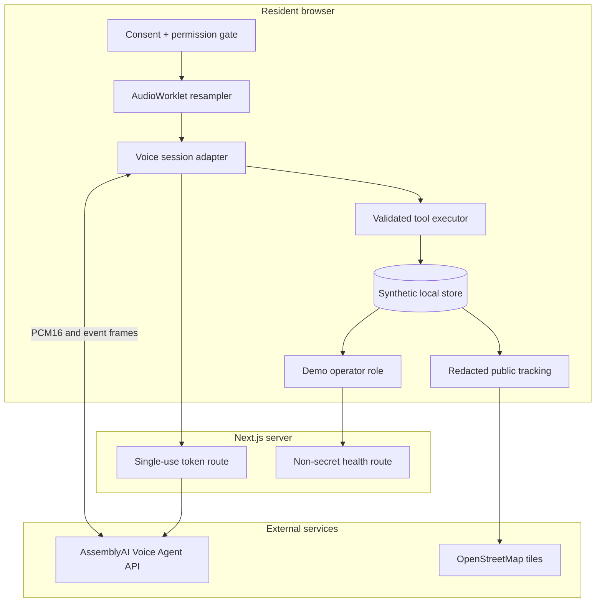

# Architecture

## Decision

FixSA Voice is a single Next.js App Router application. Public and operator interfaces share strict TypeScript/Zod contracts. A server-only route mints short-lived AssemblyAI Voice Agent tokens; all other voice-session work happens in the browser. The demo repository is local-first and deterministic, while the included PostgreSQL migration defines the production replacement boundary.

## Trust boundaries

## Runtime modes

| Concern | Demo adapter | Real adapter |
|---|---|---|
| Transcript | Timed deterministic partials | `transcript.user.delta` and `transcript.user` |
| Agent reply | Deterministic, visible text | AssemblyAI spoken audio plus `transcript.agent` |
| Tool contract | `executeDemoTool` | Same schemas via `tool.call` / `tool.result` |
| Secret | None | `ASSEMBLYAI_API_KEY`, server only |
| Persistence | Browser local/session storage | Same demo store until an authorised repository is configured |
| Audio | No capture | Ephemeral stream, resampled to PCM16 24 kHz |

## Data model

Core records are reports, conversations, transcript segments, extracted fields, evidence, duplicate matches, resolution verifications, status events, assignments, areas, categories, SLA rules, users/roles, and immutable audit events. Proof of Fix preserves operator resolution and resident verification as distinct evidence. `db/migrations/001_initial.sql` is PostgreSQL compatible and keeps audit events append-only by policy.

## Security controls

- API key never enters browser bundles, tool results, logs, screenshots, fixtures, or source.
- Temporary tokens expire before redemption and cap session duration.
- The `/ops` route family requires an explicit demo-role entry and an HTTP-only cookie. This separates resident and judge journeys, but is not production authentication; a real integration must enforce verified identity and server-side authorisation at the data-access layer.
- Security headers disable framing and unrelated camera access while allowing same-origin microphone and geolocation.
- Tool arguments are validated and unsafe state transitions fail closed.
- Public views are allowlisted rather than derived by hiding arbitrary private fields.
