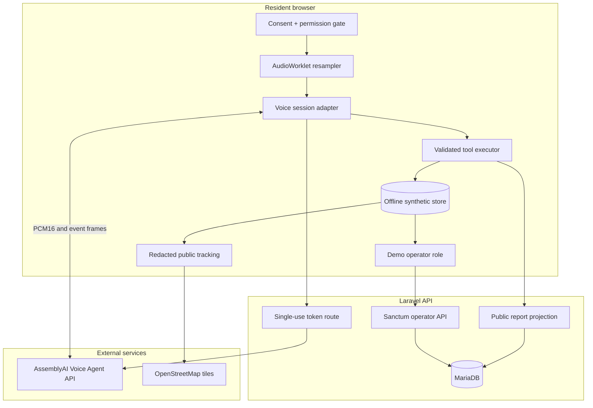

# Architecture

## Decision

FixSA Voice uses a static Next.js App Router frontend and a Laravel 13 JSON API backed by MariaDB. Public and operator interfaces share strict TypeScript/Zod contracts. Laravel mints short-lived AssemblyAI Voice Agent tokens, projects public data through an allowlisted resource, and owns all production writes. The browser-local repository remains a deterministic offline judge mode.

## Trust boundaries

## Runtime modes

| Concern | Demo adapter | Real adapter |
|---|---|---|
| Transcript | Timed deterministic partials | `transcript.user.delta` and `transcript.user` |
| Agent reply | Deterministic, visible text | AssemblyAI spoken audio plus `transcript.agent` |
| Tool contract | `executeDemoTool` | Same schemas via `tool.call` / `tool.result` |
| Secret | None | `ASSEMBLYAI_API_KEY`, server only |
| Persistence | Browser local/session storage | Laravel transactions and MariaDB |
| Audio | No capture | Ephemeral stream, resampled to PCM16 24 kHz |

## Data model

Core records are reports, transcript segments, evidence, duplicate matches, resolution verifications, status events, assignments, areas, SLA rules, users/roles, idempotency responses, and immutable audit events. Proof of Fix preserves operator resolution and resident verification as distinct evidence. Executable MariaDB-compatible migrations live in `api/database/migrations/`; [database-design.md](database-design.md) documents indexes and transaction boundaries.

## Security controls

- API key never enters browser bundles, tool results, logs, screenshots, fixtures, or source.
- Temporary tokens expire before redemption and cap session duration.
- Browser operations pages are an explicitly labelled synthetic judge preview. Production operator API routes require Sanctum authentication, active users, transition validation, and optimistic locking.
- The cPanel Apache template disables framing, MIME sniffing, unrelated camera access, and directory indexes while allowing microphone and geolocation for the resident journey.
- Tool arguments are validated and unsafe state transitions fail closed.
- Public views are allowlisted rather than derived by hiding arbitrary private fields.
