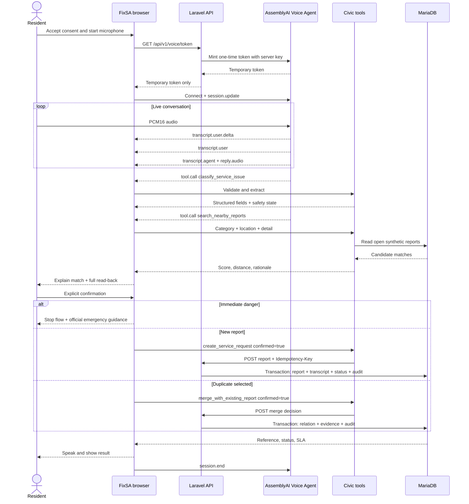

# Voice and work-order data flow

## Public-view projection

Only reference, category, approved location detail, status timeline, SLA state, public evidence, and approved public notes cross the Laravel public resource. Full transcripts, internal notes, assignees, contact identifiers, private evidence, tool arguments, and exact private-home detail stay outside that projection.
